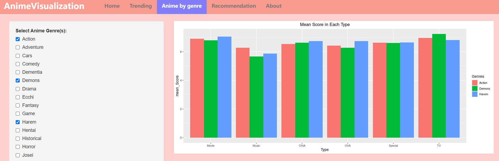

# Interactive component

## [App Link](https://tonyz.shinyapps.io/AnimeVisulization/)

## Overview
By developing this Shiny app, we aim to provide a smooth experience for beginners to find their favorite animes, and some exploraion choices for anime experts to find more interesting animes. We decide to implemented three functions: Anime trending and search, random anime recommendation, as well as a tuned recommendation system that looks for anime that people with similar interests like.

## Introduction

- Anime Trending: In this section, the customer could navigate through the anime database that are sorted by score, popularity, favorites and watching status, and get to see what anime fans are interested in! Follow the pace of other anime fans and find the most popular and highly rated anime!  

- Anime Search: In this section, the customer could find a more tuned list by choosing some specific favorite type and genre, and see what are the top rated anime! 

## Anime by Genre
This page is to give our customer a overview of the mean score of animes by genres and types. 

## Recommendation
- Our goal is to give our customer a recommendation list knowing one or two of the customer's favorite animes. We use the language model to assign a probability to a piece of each anime's name. In our daily life, language models are often used in typing software and web pages to predict the next word or paragraph of words. 
- We select 4000 users' favorite lists which contain anime lists sorted by time and popularity. We treat each anime name as a word and use Markov Assumption to infer the relationship between animes. We apply bigrams and trigrams models to give the customers a choice of writing down one or two anime they like. Our tab will return a list of anime ordered by probability and popularity. These are the animes users put in their favorite lists after the anime the customer typed in. 

## Potential Problems
Our data set is realatively large, so it may take a long time for the website to show all of our results. 