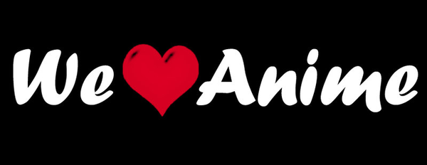

# Conclusion

As anime fans, we are having fun dealing with different patterns and trending of anime. 

In this project, we do the sentiment analysis first to find the cluster of anime by genres. Then we focus on the relationship between anime scores and anime genres/types. Next we find the trending of anime episodes overtime. Finally we develop an animation recommendation website to recommend anime for potential audiences. 

The one ultimate reason that we hold anime close to us, despite all the various great things too it beyond this, is the messages it tells in its stories, in its characters, in its episodes and chapters. Some are simple and straight forward and cliche, and some are complex and nuanced and thematically deep. Anime has some of the greatest life lessons we have ever experience and more then any, they have realistically connected and developed us in many ways. And that is the main reason we love anime.

