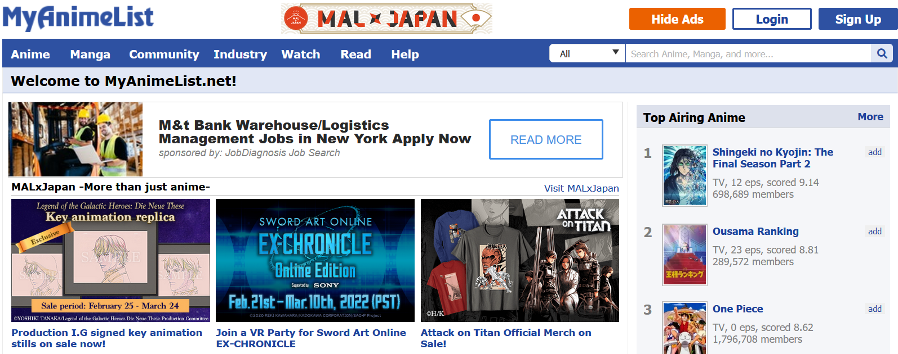

### Anime Visualization	

*This repo was initially generated from a bookdown template available here: https://github.com/jtr13/EDAVtemplate.*	
## Term: Spring 2022

+ **Team Member**:
  + Haozhong Zheng
  + Weixun Qian

## Project Proposal 
# Description of dataset
We will develop a web crawler to get data from [MyAnimeList](https://myanimelist.net/), a professional anime rating website in Europe and North America. According to [Wikipedia](https://en.wikipedia.org/wiki/MyAnimeList), the site received 120 million visitors a month in 2015. The dataset will include several tables, the first one is the **Anime table** (anime ID, name, average rating, genre and synopsis), the second one is the **watching status table** (user_id, anime_id, watching_status, watched_episodes), the last one is the **review table** (user_id, anime_id, review_text, review_score)

# Questions we want to focus

We want to explore the dataset and find potential answers to three main questions:

+ As an Anime producer, what genre would attract considerable amount of audience. And given a specific genre that we want to focus on, what are audience's common sentiment towards this type of anime, and what should we do to satisfy their need.
+ As an Anime fan, if my friends want me to recommend an Anime, what should my recommendation be based on (genre, number of episodes, length, anime topic) so that my friends would find what they truly want and love.
+ As time goes, how each genre of anime evolved (number of episodes, average length, and other characteristics), and how the taste of audience evolved. Would the most popular genre (evaluate by number of anime that are based on this genre) have the highest rating?

# How do we solve these questions

+ For the first question, we could group the dataset by genre and plot their info respectively. Given a specific genre, we could filter the dataset and apply sentiment analysis to the review data to see how users feel about this genre, we may further separate the review data by ratings to examine if there are differences between emotions of high rating reviews and low rating reviews.

+ For the second question, we could cluster the anime and users after feature engineering to see if there are significant features that affect one's taste of anime.

+ For the third question, we could extract features that could accurately measure popularity and quality from the dataset, and then plot the data in each time period to see how these features evolve as time goes.

### Additional features	

Please consult the official guide to **bookdown**: https://bookdown.org/yihui/bookdown

